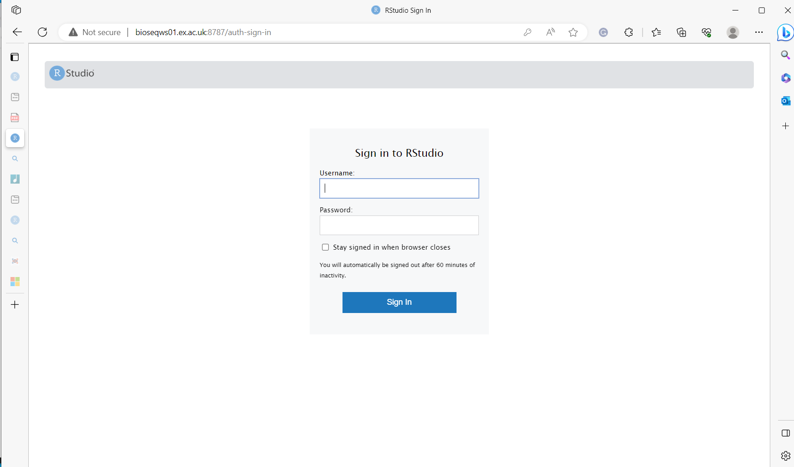
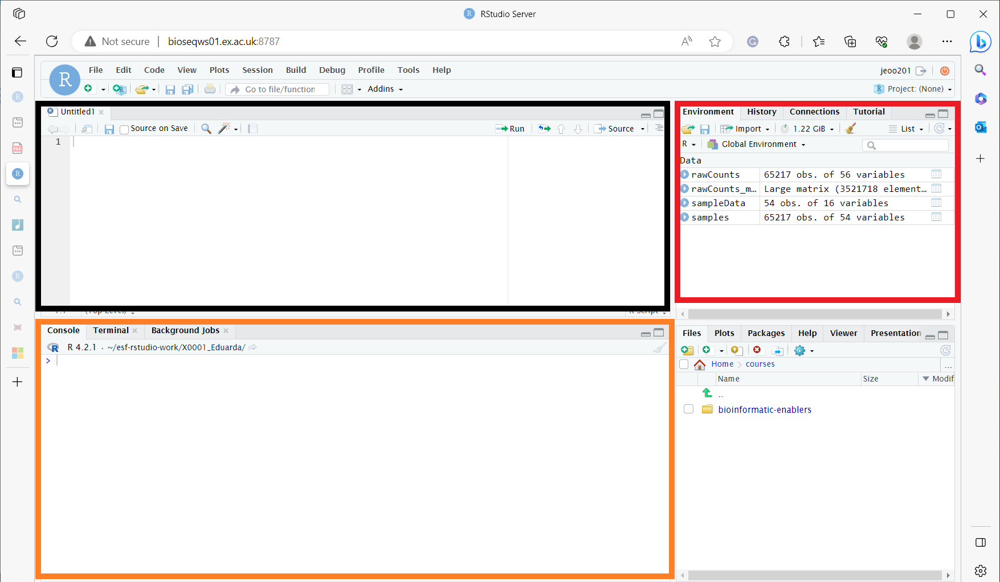

# R studio box
There are many bioinformatics packages that might help you in R. R is a powerful programming language used for statistical computing and graphics.  

At this stage of the analysis you might already have count matrices and your data is not as huge as your raw reads. So it is possible to perform them on your device. Many people use in RStudio. Rstudio is an integrated development environment specifically for R. You can install it on your device following the instructions [here](https://posit.co/download/rstudio-desktop/) in your own time. In this practical we will use the Rstudio server which is run on a remote server and can be accessed through a web browser.

# How to connect to the R studio server

Please open this link <http://bioseqws01.ex.ac.uk:8787/> on your browser.
You can then log in with your short name username under username. For example pao207 or jeoo201.

# Key features of R studio set up

Once you start you should see a page similar to the one above. I would like to point out some key features about the page. The orange box highlights the bottom panel where you might notice a few tabs such as Console, Terminal and Background. The main tabs we will use in this course are Console and Terminal. Terminal connects to the linux command line and it starts with  A $ sign, we won't really use that in this tutorial. In the console tab is where we will be typing most of our code and it starts with a > symbol.

The highlighted black box will appear with content once we attempt to visualise tables or various objects in R. The box has a few tabs but I would like to point out the Environment. The Environment demonstrated the variables and different objects that are present in your session. The History tab should show you what previously you have typed. There shouldn't be much at the moment but there should be more and this is were you can copy your code to save it for later.

Now take your time to explore the space and to ask questions if you are unsure of what certain things are. 
