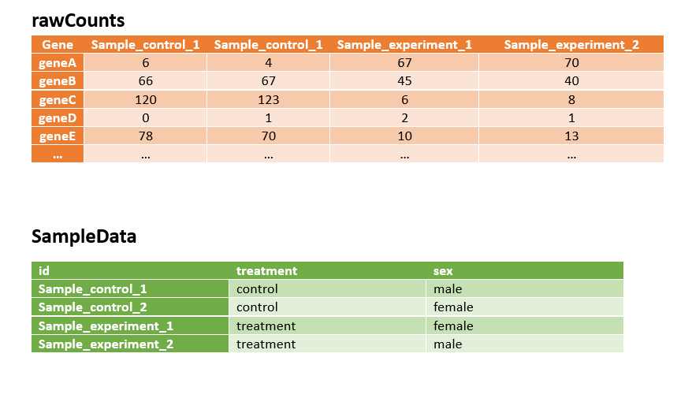
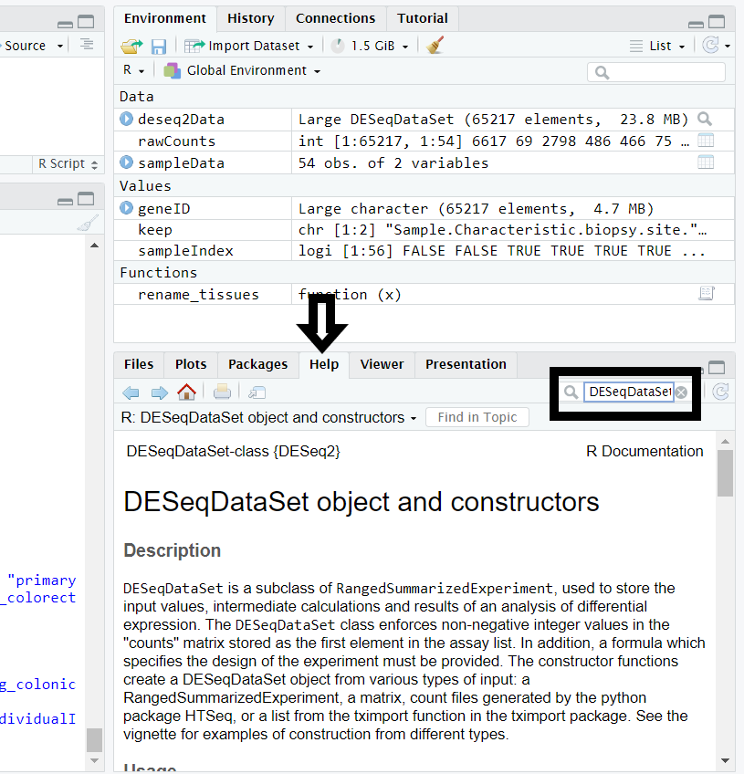

## Preparation for the data

For this practical we will start with raw unnormalised matrix counts. You can seek advice from us or others regarding the alignment of transcripts and the quantification of them. The quantification data required to run differential expression analysis using DEseq2 are raw readcounts for either genes or transcripts. We will use the output from HTseq, a quantification tool as a starting point.

We will begin by downloading the data and assigning it to a variable. Variables are objects in R that have values and in this course we will create many variables with values such as characters or even matrices. You can create your own variables just make sure that they don't start with a number and that they are informative. We recommend it is best to not copy the code as you would learn and understand it better if you take the time to type it out.

Loading some libraries
```
library("AnnotationDbi")
library(dplyr)
library(ggplot2)
library("DESeq2")
library("cowplot")
library("pheatmap")
library(tibble)
library(clusterProfiler)
library(DOSE)
library(rtracklayer)

```


```
rawCounts <- read.delim("http://genomedata.org/gen-viz-workshop/intro_to_deseq2/tutorial/E-GEOD-50760-raw-counts.tsv")


# Read in the sample mappings
sampleData <- read.delim("http://genomedata.org/gen-viz-workshop/intro_to_deseq2/tutorial/E-GEOD-50760-experiment-design.tsv")

```


Throughout this tutorial we will use the command ```head``` that displays the first few rows of a table. It is always good to check and look what is going on in between steps and that a command has performed in the way that you expected it to perform.

```
head(rawCounts)
head(sampleData)
```
If you are just starting out a good trick is to type the beginning of a command or variable and then press tab to help autocomplete or give you options that match. This can save time from typing.

The input for deseq2 needs to look like something in the picture below.




At the moment our data is not looking like this but we need to make it look like this.

As you can see with the rawCounts there is a column corresponding to ENSEMBL gene names another one corresponding to gene symbols while the rest of the columns are the sample names. For the sampleData we have a lot of information regarding the stage of the cancer and whether it has been analysed. This is all good information to record but for this exercise we are interested in just a few columns. It is important to ensure that we extract the needed information.


Now we have our raw data but we need to ensure that it is in the right format for Deseq2. Deseq2 is a method to detect differentially expressed genes it uses various algorithms to calculate it and it takes into consideration the sequencing depths. [Here](http://bioconductor.org/packages/devel/bioc/vignettes/DESeq2/inst/doc/DESeq2.html#standard-workflow) is a link with an example standard workflow for Deseq2. For Deseq2 the rows must be gene identifiers and the columns must be sample names. It is important to ensure that for Deseq2  that the sample names do not start with numbers.

The gene ids were extracted and assigned to the variable called geneID.
```
#extract the gene symbol from the raw read counts we imported.
geneID <- rawCounts$Gene.ID
head(geneID)
```

Now we are extracting the sample names, not their content just their names by using the command ```grepl``` that find matching patterns.

```
sampleIndex <- grepl("SRR\\d+", colnames(rawCounts))
#Sanity check
head(sampleIndex)
```
When we look at a subsample of sampleIndex we should see a list of TRUE and FALSEs these correspond to whether the Colum name starts with SRR. If it does, then TRUE is added to the list and if it does not it results in a FALSE value. Once we have checked we now create a matrix extracting the columns corresponding to the sampleIndex with TRUEs.
```
rawCounts <- as.matrix(rawCounts[,sampleIndex])
head(rawCounts)
```
We are almost done we now generate rownames for our new table using the geneIDs.
```
rownames(rawCounts) <- geneID
head(rawCounts)
```
Now your data RAW counts are ready for Deseq2. We can use the SampleData variable to create the suitable metadata needed for Deseq2. The metadata highlights what group each sample is assigned to.

First let us remind ourselves how the data looks like.
```
head(sampleData)
```
You can see from the SampleData that the Run columns corresponds to the sample name. What we want are the columns Run,Sample.Characteristic.biopsy.site. and Sample.Characteristic.individual. In this particular example we are going to use both the biopsy site and the patient details. In theory depending on what you are looking for you could just use the biopsy type but by including the Sample.Characteristic.individual. you can use this information for other experiments when there might be a known batch effect.

The code below will create the sample names as rownames.
```
rownames(sampleData) <- sampleData$Run

```
Now we are trying to retain the columns that we want such as Sample.Characteristic.biopsy.site.", "Sample.Characteristic.individual.
```
 keep <-c("Sample.Characteristic.biopsy.site.","Sample.Characteristic.individual.")
```
We are now creating a table where we just keep the columns we previously described.
```
sampleData <- sampleData[,keep]
```
Perfect now we have a table with all the information we need. Go ahead and have a look at it with the ```tail``` command.

The data looks good but let's add a few more touches that need to be done for example renameming the column names as tissueType adn IndividualId so that they are more informative for our benefits.
```
colnames(sampleData) <- c("tissueType", "individualID")
head(sampleData)
```
We now need to turn the IndividualID and the Tissuetype into factors. Factors is a data structure used to for the storage of categorical data. Which is required for Deseq2.
```
sampleData$individualID <- factor(sampleData$individualID)
sampleData$tissueType <- factor(sampleData$tissueType)
head(sampleData)
```

This shouldn't result in any visual changes to the data.

Next we need checks that the column names of the rawCounts match with the rownames of the SampleData. if they are not in the right order Deseq2 won't work.
```
all(colnames(rawCounts) == rownames(sampleData))
```
This command should return a TRUE statement. That should make us happy to proceed.

Now we plan to rename the tissue types
by creating a function called rename_tissue that takes in x and changes words such as normal into more descriptive names. We are doing this for two reasons, it is always an advantage to have descriptive group names and we want to remove the names with spaces. Generally in programming you want to avoid creating anything that has spaces in the name. For example you can try and creating a variable with the value 5.
```
number five <- 5
```
You should see that you get an error. Spaces can also create troubles with paths. It is reccommend instead to use underscores(_),dots(.), or hypens(-) instead of spaces.
```
rename_tissues <- function(x){
  x <- switch(as.character(x), "normal"="normal_looking_surrounding_colonic_epithelium", "primary tumor"="primary_colorectal_cancer",  "colorectal cancer metastatic in the liver"="metastatic_colorectal_cancer_to_the_liver")
  return(x)
}
sampleData$tissueType <- unlist(lapply(sampleData$tissueType, rename_tissues))
head(sampleData)
```
Order the tissue types so that it is sensible and make sure the control sample is first: normal sample -> primary tumor -> metastatic tumor.
```
sampleData$tissueType <- factor(sampleData$tissueType, levels=c("normal_looking_surrounding_colonic_epithelium", "primary_colorectal_cancer", "metastatic_colorectal_cancer_to_the_liver"))
head(sampleData)
```
Once that is sorted our data is ready for Deseq2.We will start by creating the DEseq2DataSet object
```
deseq2Data <- DESeqDataSetFromMatrix(countData=rawCounts, colData=sampleData, design= ~ individualID + tissueType)
```
If you want to know what ```DESeqDataSetFromMatrix``` and better understand the parameters do we can use the help tab. Illustrated in the picture below.



Then we can type in the name of the command that we want to learn more of in the search bar. This tool is quite handy especially if we are following other people's code and we are unsure what certain command do. I highly encourage all of you to use the Help tab often. In regards to the DESeqDataSetFromMatrix matrix we typed in earlier the key thing to mention is that we used two features in our design the individualID and the tissueType. In our case the individualID is a confounding factor that might create a batch effect thus it is placed before the feature we are truly interested in which is the type of tissue.


Lastly for this section we are going to use the ```dim``` command. Why not use the Help tab to see what it does. I personally found ```dim``` a useful command to check that haven't duplicated or lost rows on the way.
```
dim(deseq2Data)
dim(rawCounts)
```
Some bits of this workshop were adapted from https://genviz.org/module-04-expression/0004/02/01/DifferentialExpression/
