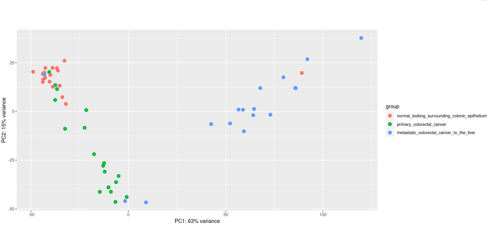
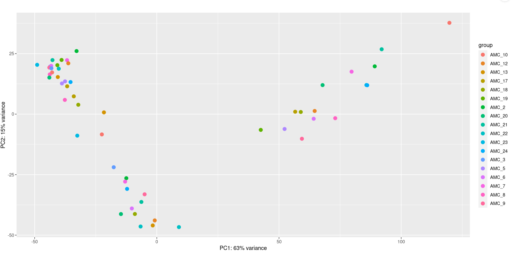

# Visualising your Data

Great job we are right on way. We have run Deseq2 and normalised our counts now let's great some plots to visualise out data. We will begin with a PCA plot.

## making PCA plot

What is PCA plot? It stands for principal component analysis and it a simple way to look at how related data points are to each other. First we use ```vst``` (variance stabilisation transformation) as a way to transform the data and make it suitable to visualise it via a PCA plot.
```
vsd = vst(deseq2Data, blind = FALSE)

```

Now we plan to visualise the plot with just the tissueType.

```
plotPCA(vsd, intgroup = c("tissueType"))
```




At this stage our data is looking pretty good. Go the left right bottom quadrant and press on the Plot tab and then click on the zoom bottom to have a good look at the PCA plot generated. You can tell that the normal_looking_surrounding_colonic_epithelium and the primary_colorectal_cancer cluster to the left while the metastatic_colorectal_cancer_to_the_liver dominantly cluster to the right.This is probably what we expected.

Now if you remember we used 2 design features Tissuetype and individualID let's try and visualise the PCA plot but with the individualID.
```
plotPCA(vsd, intgroup = c("individualID"))
```


If we remember correctly we have 18 patients and 3 tissues samples were collected from them. At this stage as we are just looking at the PCA plots with the indidualIDs. What we are looking for is a lack of clustering for example if samples from 1 patient all clustered together it might indicate a problem with the sample and thus it might be best to remove that sample from the rawCounts, but in this case there are no individuals just clustering to one side.  

There is another method to transform data for pca which is called 'regularized log' transformation to transform the data for visualisation that tends to be a bit more robust if there high variability in the size factor data.

<details>
           <summary>Could you try and perform the same steps but with regularized log transformation instead of using variance stabilisation transformation technique. Please note that if you do try this it might take a minute. </summary>
           <p>``` rlogd = rlog(deseq2Data, blind = FALSE)
           plotPCA(rlogd, intgroup = c("tissueType"))#plot the PCA with the jus the tissue type
           plotPCA(rlogd, intgroup = c("individualID"))#plot the pca with just the individualID ``` </p>
</details>

We can now try to visualise both the tissueType and individualID together
visualising the PCA plot with the tissueType and Individual ID. The key thing here is can you pick out any outliers?
```
pcaData <- plotPCA(vsd, intgroup=c("tissueType", "individualID"), returnData=TRUE)
percentVar <- round(100 * attr(pcaData, "percentVar"))
ggplot(pcaData, aes(PC1, PC2, color=individualID, shape=tissueType)) +
  geom_point(size=3) +
  xlab(paste0("PC1: ",percentVar[1],"% variance")) +
  ylab(paste0("PC2: ",percentVar[2],"% variance")) +
  coord_fixed()
```
The thing always to look out for is to make sure there aren't samples from a single patient all clustering together. It is important to note that even if there are outliers observed that don't fit the pattern it is important to weight up the cost of removing a sample. If you exclude the samples from patient x one could improve the statistical significance of the analysis being performed.

## Comparisons creation

let's create a few contrasts. Contrasts are comparisons between different groups. We are primarily looking at tissue types although depending on question we are asking we could use different comparison. It is good practice to place the "control" 2nd. As this would mean that the genes that are positive will be upregulated in the one that is being compared 1st compared to the 2nd one.

```
result_primary_vs_normal <- results(deseq2Data, contrast=c("tissueType", "primary_colorectal_cancer", "normal_looking_surrounding_colonic_epithelium"))

head(result_primary_vs_normal)
```
This below is a function that takes in
res_files_deseq_2file,padj_value and log2fold changes and uses dplyr to filter them.
```
filtering_results <- function(res_file,padj_value,log2foldchange_value){
  output<-dplyr::filter(as.data.frame(res_file),(padj<= padj_value & (log2FoldChange >= log2foldchange_value | log2FoldChange <= -log2foldchange_value)))
}
```
Why would you filter in this manner rather than using the deseq2 results function? That is an extremely good question. The thing is that is you set a p-value cutoff in the results part it does not filter out those genes it keeps them there but with a NA value for the p-value.

so to just visualise the pheat map we chose a log2fold change of 2 and pajusted value of 0.05. We then extract the rows corresponsind to that filterinf from the vsd file that contains all the samples but the

```
filtered_result_primary_vs_normal<-filtering_results(result_primary_vs_normal,0.05,2)

pheat_filtered_result_primary_vs_normal <- data.frame(assay(vsd)) %>% dplyr::filter(rownames(vsd) %in% rownames(filtered_result_primary_vs_normal))
```
## Let's generate a heatmap
```
pheatmap(
  pheat_filtered_result_primary_vs_normal,
  cluster_rows = TRUE, # Cluster the rows of the heatmap (genes in this case)
  cluster_cols = TRUE, # Cluster the columns of the heatmap (samples),
  show_rownames = FALSE, # There are too many genes to clearly show the labels
  annotation_col = sampleData,
  main = " ",
  colorRampPalette(blues9)(25),
  scale = "row" # Scale values in the direction of genes (rows)
)
```


<details>
           <summary>Can you try and figure out how to remove the sample name at the bottom? </summary>
           <p>``` show_colnames=FALSE ```</p>
</details>

<details>
        <summary>Could you potentially identify which 2 samples could have been switched around according to the PCA plot and gene heatmap. </summary>

        <p>SRR975588
        SRR975587</p>
</details>

In these scenario they haven't been switched around and when double checked the sample name correspond to the tissue so at this point let's continue on. It is important to always double check your data and that if there is any doubt to email the facility that sequenced your data and to check your notes.
