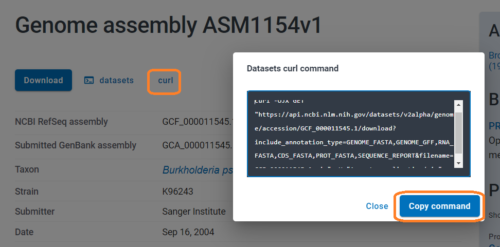
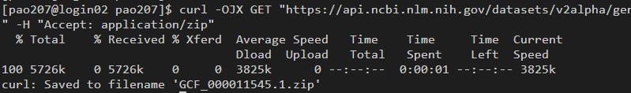

## A note about ISCA
When you first you log onto ISCA, you will be on the 'login node' - that is the computer that everyone logs into.  
You can check by typing the command `who`  
Since it is a shared resource you should not do anything that is computationally intensive on this server.  
If you run anything that requires more resource, there are two options.
- submit a batch job
- start an interactive session.


## Create a folder to contain your work:

Change to the folder ecr2023 in the BioTraining area and create a personal sub-folder as your name.  
**note** the environment variable ${USER} is should be set to your account name in the script you can use them interchangeably.

```
cd /lustre/projects/Research_Project-BioTraining/ecr2023
mkdir ${USER}
cd ${USER}
```


## Download and Prepare the reference

First we need the reference genome of the species we are going to be dealing with in this case 'Burkholderia pseudomallei K96243'.


Obtain your reference genome - in a browser navigate here: 
[Burkholderia pseudomallei K96243](https://www.ncbi.nlm.nih.gov/datasets/genome/GCF_000011545.1/)




click `curl` and then `copy command` and paste it into your terminal - you should get similar output:



Extract the reference.
```
unzip GCF_000011545.1.zip
```

