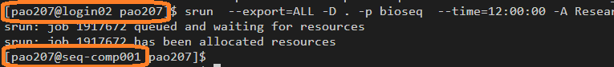
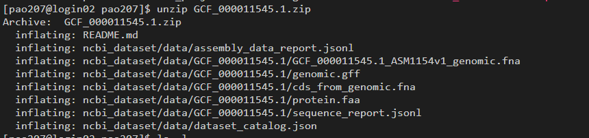
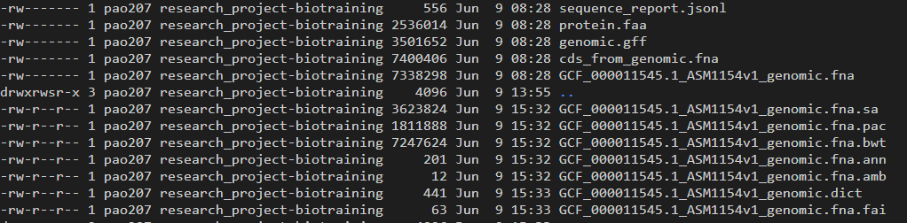

## A note about ISCA

When you first you log onto ISCA, you will be on the 'login node' - that is the computer that everyone logs into.  
You can check by typing the command `who`  
Since it is a shared resource you should not do anything that is computationally intensive on this server.  
If you run anything that requires more resource, there are two options.

- submit a batch job
- start an interactive session.

This will allow you to run more computationally intensive commands on 'compute nodes' without affecting others.

## Create a folder to contain your work

Change to the folder ecr2023 in the BioTraining area and create a personal sub-folder as your name.  
**note** the environment variable ${USER} is should be set to your account name in the script you can use them interchangeably.

```
cd /lustre/projects/Research_Project-BioTraining/ecr2023
mkdir ${USER}
cd ${USER}
```

## Download the reference

this is not strictly necessary as the reference is very small, but as good practice start an interactive session.

```
srun  --export=ALL -D . -p bioseq  --time=12:00:00 -A Research_Project-BioTraining --nodes=1  --ntasks-per-node=1 --pty bash -i
```



You will notice the prompt on your computer change from 'login' to 'comp'
The parition `-p bioseq` and the account are specific for this course `-A Research_Project-BioTraining` if you come to use ISCA for your own analysis you will need to use your own account and tone of the public partitions.  
See the [EXeter RSE Introduction to ISCA](https://uniexeterrse.github.io/intro-to-isca/) for more details.

First we need the reference genome of the species we are going to be dealing with in this case 'Burkholderia pseudomallei K96243'.

Obtain your reference genome - in a browser navigate here:
[Burkholderia pseudomallei K96243](https://www.ncbi.nlm.nih.gov/datasets/genome/GCF_000011545.1/)


click `curl` and then `copy command` and paste it into your terminal - you should get similar output:


Extract the reference.

```
unzip GCF_000011545.1.zip
```



The main files we are interested in are the .fna file which is the fasta reference and the gff file which is the genome feature file. Use `less` to have a look at these files.

## Prepare the reference

You now have the contents of the reference, but some of the programs we use requires additional files to support access them efficiently.  
So we will build these all up front.  

We are going to use 'bioconda environments' to access bioinformatic tools - thousands of bioinformatic tools are packages and can be downloaded and run using bioconda recipies.
It is well worth you investing some time understanding how this works. (but but now!). [BIOCONDA](https://bioconda.github.io/index.html)  

Here we will use a program called [BWA](https://github.com/lh3/bwa)

```
. "/gpfs/ts0/shared/software/Miniconda3/4.9.2/etc/profile.d/conda.sh"
conda activate /lustre/projects/Research_Project-BioTraining/ecr2023/bioconda-envs/bwa
```

```
cd /lustre/projects/Research_Project-BioTraining/ecr2023/${USER}
cd ncbi_dataset/data/GCF_000011545.1
```

```
bwa index GCF_000011545.1_ASM1154v1_genomic.fna
samtools dict GCF_000011545.1_ASM1154v1_genomic.fna > GCF_000011545.1_ASM1154v1_genomic.dict
samtools faidx GCF_000011545.1_ASM1154v1_genomic.fna
ls -latr
```



## Download the data

```
cd /lustre/projects/Research_Project-BioTraining/ecr2023/${USER}
curl https://sme.uds.exeter.ac.uk/files/fb802af51dc77a231c1250018906dfef.tar -o ECR_Genomics-2023_raw_reads.tar
tar -xvf ECR_Genomics-2023_raw_reads.tar 
ls -l 01_raw_reads
```

## Recap
So for we have:
- Downloaded the reference genome from NCBI
- Build the indexes we require for for future analysis
- Downloaded the experimental data set.