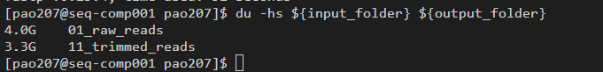

## Preparation

Make sure you are on a compute node.

And you are in the correct folder
```
cd /lustre/projects/Research_Project-BioTraining/ecr2023/${USER}
```

Activate the sequencing_qc environment that contains the tools we need.

```
. "/gpfs/ts0/shared/software/Miniconda3/4.9.2/etc/profile.d/conda.sh"
conda activate /lustre/projects/Research_Project-BioTraining/ecr2023/bioconda-envs/sequencing_qc
```

## Initial Quick QC of your data

### Now run FastQC and MultiQC to determine trimming parameters


We are going to use bash variables a lot - ask an instructor if you don't understand.

```
QC_FOLDER=09_QC_Reports     # assigns a string "09_QC_Reports" to the variable QC_FOLDER
echo ${QC_FOLDER}           # wherever we use ${QC_FOLDER} it will be replaced by 09_QC_Reports
```

```
mkdir -p ${QC_FOLDER}/fastqc1
fastqc --threads 10 --outdir ${QC_FOLDER}/fastqc1 01_raw_reads/*.fq.gz
multiqc --filename initial_multiqc.html --outdir=${QC_FOLDER} .
```

Use WinSCP to examine the multiqc report and the (individual fastqc reports if you wish)  
hint: use `pwd` to get your current folder and paste it into the address bar of winscp.

We want to trim illumina sequencing adapters and low quality reads from the 3' end of the sequences. We will then discard any reads that are shorter than a certain length.

The key things to think about:

- adapter content
- read qc profile
- decide on canditate settings for required_length and qscore.
- consider the data-set and how much data you will be losing


In this dataset, the quality is good and it is not too critical we can choose 100 for the miniumum length, and 22 as the qscore to trim.

```
QC_FOLDER=09_QC_Reports
qscore=22
length_required=100
input_folder=01_raw_reads
output_folder=11_trimmed_reads
reports_folder=${QC_FOLDER}/fastp_reports
sample=wildtype

mkdir -p ${output_folder} ${reports_folder}

fastp \
    --cut_tail \
    --cut_tail_mean_quality=${qscore} \
    --length_required=${length_required} \
    --thread=16 \
    --in1=${input_folder}/${sample}_r1.fq.gz \
    --in2=${input_folder}/${sample}_r2.fq.gz \
    --out1=${output_folder}/${sample}_R1_fastp_fastq.gz \
    --out2=${output_folder}/${sample}_R2_fastp_fastq.gz \
    --html=${reports_folder}/${sample}_fastp.html \
    --json=${reports_folder}/${sample}_fastp.json
```

But we have 5 samples so there is a better way than typing this 5 times.

Create a file called samples.txt
```
cd 01_raw_reads
ls -1 *_r1.fq.gz | xargs -i -n 1 basename {} "_r1.fq.gz" | tee ../samples.txt
cd ..
cat samples.txt
```

Now run in a loop
```
while read sample; do
    echo ${sample}
    fastp \
        --detect_adapter_for_pe \
        --cut_tail \
        --cut_tail_mean_quality=${qscore} \
        --length_required=${length_required} \
        --thread=16 \
        --in1=${input_folder}/${sample}_r1.fq.gz \
        --in2=${input_folder}/${sample}_r2.fq.gz \
        --out1=${output_folder}/${sample}_R1_fastp.fastq.gz \
        --out2=${output_folder}/${sample}_R2_fastp.fastq.gz \
        --html=${reports_folder}/${sample}_fastp.html \
        --json=${reports_folder}/${sample}_fastp.json
done < samples.txt
```

Sanity check - this is just a quick check to make sure things have worked...

```
du -hs ${input_folder} ${output_folder}
```

The output folder will be quite a lot smaller, you will have trimmed and removed some reads, but also because you have remove sequencing errors disproportionaly the files will compress more efficiently.



This does not mean you have lost nearly a quarter of your data!

## Run Fastqc again on the trimmed files.

```
QC_FOLDER=09_QC_Reports
mkdir -p  ${QC_FOLDER}/fastqc2
fastqc --threads 10 --outdir ${QC_FOLDER}/fastqc2 11_trimmed_reads/*.fastq.gz
multiqc --filename after_trim_multiqc.html --outdir=${QC_FOLDER} .
```

## Review

Review the multiQC report (and the individual reports if you wish)
You are looking for:

- effective, but appropriate level of trimming.
- consistency between adapter content and insert size.
- consistency between samples.

## Summary

You have now removed artificial (adapter) sequences and low quality nbases from your data set. All your data now should be valid biological sequences and you are ready to proceed with analysis.
