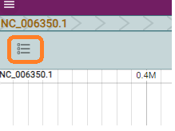

## Visualising your results

An important step is to visualise and refine your results

Download the tsv your created and open in Excel.

Examine the variants and highlight differences in the genotypes of your samples.

We will use a jbrowse2 server that has been set up.

Navigate to [here](http://bioseqws01.ex.ac.uk:3000/)

Start New Session  
Launch 'Linear Genome View'] and 'Open'

Now 'Open Track Selector'

Use the coordinate in your tsv file to visualise variants.

In the list of tracks, tracks starting with lii consist of the whole assembly (after left align indels) and tracks starting hc are small sections of realignments after reassembly by the hoplotype caller step.

Look at the Quality scores of the variants and try to decide the cutoff for real variants and artefacts.